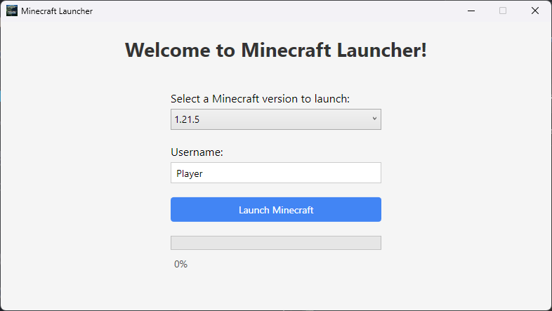

# 🎮 Minecraft Offline Launcher (WPF App)

A sleek, user-friendly Minecraft launcher built with **C# and WPF**, allowing you to launch **official Mojang vanilla Minecraft** in **offline mode** with **any username**.

Powered by [`clmlib`](https://github.com/Clashsoft/clmlib), this launcher automatically handles asset downloads, version management, and launching the Minecraft client.

---

## 🖼️ Features

- ✨ Clean and modern WPF interface
- 🧑‍💻 Launch Minecraft in **offline mode** using any username
- 📦 Supports **any vanilla version** (e.g. `1.20.4`, `1.8.9`, etc.)
- 🔄 Automatically downloads:
  - Minecraft client JAR
  - Assets and libraries
  - Runtime dependencies
- ⚙️ Built entirely in **C#** using **.NET 6+ and WPF**

---

## 📸 Screenshot

> **

---

## 💻 Requirements

- [.NET framework 4.8 SDK or later](https://dotnet.microsoft.com/en-us/download/dotnet-framework)
- Windows 10 or later
- Internet connection (only required on first run per version)

---

## 🛠️ How to Build & Run

### You can download the official latest msi release [here](https://github.com/user5012/MinecraftLauncher/releases/download/1.0.0/Minecraft.Launcher.Setup.msi)
---

1. **Clone the repository**

   ```bash
   git clone https://github.com/user5012/MinecraftLauncher.git
   cd MinecraftLauncher

2. **Open in Visual Studio**
   * Open the .sln file in Visual Studio 2022 or later.
   * Restore NuGet packages (automatically done by VS).
   * Set the WPF project as startup project.

3. **Build & Run**
   *Click Start (F5) or build the project and run the .exe manually from bin/Debug/net6.0-windows/

## 🧰 Tech Stack
  * Language: C# (.NET 6+)
  * UI Framework: WPF
  * Minecraft API: clmlib

## ⚠️ Disclaimer
This launcher runs Minecraft in offline mode, which does not require Mojang or Microsoft account authentication.

> ⚠️ This is intended for educational, modding, testing, and private use only.
> You must own a legal copy of Minecraft to comply with Mojang's EULA.
> Do not use this for piracy or unauthorized distribution.

## 📄 License
This project is licensed under the MIT License. See the [LICENSE](LICENSE) file for details.

## 🙋 Author
Kyrma
GitHub: @user5012

## 🤝 Contributions
Feel free to open issues or submit PRs. Suggestions and improvements are welcome!
